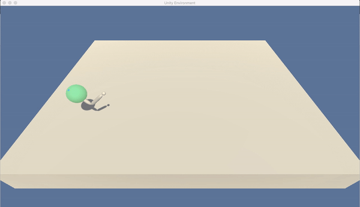

# Reacher Agent - Project-2 Continuous Control

This project is part of <b>Udacity's Deep Reinforcement Learning Nanodegree</b> and is called <b>Project-2 Continuous Control</b>. This model was trained on a MacBook Air 2017 with 8GB RAM and Intel core i5 processor.

## Description

<p align="justify">The project has two types of environment one with a single agent and the other with twnety (20) agents. Each agent is tasked to follow a green colored ball. If the agent is able to successfully catch up with its corresponding ball then the ball lights up (becomes opaque and turns light green), otherwise it remains transluscent with a dark green color. The environment is part of Unity ML Agents. An agent gets a reward of <b>+0.1</b> for each step that it can successfully follow its corresponding green ball. This environment does not involve a negative reward, in case the agent cannot follow its corresponding ball for a particular step then it does not get a reward (0 reward).

<p align="justify">The state space has <b>33</b> dimensions that correspond to position, velocity and angular velocity of an agent. The agent can perform <b>4</b> different actions which correspond to torque applied to the two joints of an agent.</p>

<p>The agent's task is episodic and is solved when the agent gets atleast <b>+30</b> over consecutive <b>100</b> episodes.</p>

<p>For this task I used a Deep Deterministic Policy Gradeints (DDPG) which is an Actor-Critic method.</p>

<p align="justify">The Actor model takes as input the current 33 dimensional state and passed through <b>two (2)</b> layers of multi layered perceptron with <b>ReLU</b> activation followed by an output layer with <b>four (4)</b> nodes each activated with <b>tanh</b> activation which gives the action to take at the current state.</p>

<p align="justify">The Critic model takes as input the current 33 dimensional state and the 4 dimensional action which is passed through <b>two (2)</b> layers of multi-layered perceptron with <b>ReLU</b> activation. After the first layer's activation is computed then only the actions are given as input, so the actions are passed from the second layer. The final layer has a single node activated with <b>linear</b> activation which gives the Q-value for the corresponding (state, action) pair.</p>

## Demo

<p align='center'>
  
</p>

<p align='center'>
  
</p>

<p>The thing I truly loved is even though the agent was trained on the environment with <b>twenty (20)</b> agents but it was able to generalize for a <b>single (1)</b> agent. :heart:. This is the power of generalization of a Neural Network :muscle: :sunglasses:.</p>

## Steps to run

<ol>
  <li>Clone the repository:<br><br>

  ```console
  user@programer:~$ git clone https://github.com/frankhart2018/reacher-agent
  ```

  </li>
  <li>Install the requirements:<br><br>

  ```console
  user@programmer:~$ pip install requirements.txt
  ```

  </li>
  <li>Download your OS specific unity environment (single agent):
    <ul>
      <li>Linux: <a href='https://s3-us-west-1.amazonaws.com/udacity-drlnd/P2/Reacher/one_agent/Reacher_Linux.zip'>click here</a></li><br>
      <li>MacOS: <a href='https://s3-us-west-1.amazonaws.com/udacity-drlnd/P2/Reacher/one_agent/Reacher.app.zip'>click here</a></li><br>
      <li>Windows (32 bit): <a href='https://s3-us-west-1.amazonaws.com/udacity-drlnd/P2/Reacher/one_agent/Reacher_Windows_x86.zip'>click here</a></li><br>
      <li>Windows (64 bit): <a href='https://s3-us-west-1.amazonaws.com/udacity-drlnd/P2/Reacher/one_agent/Reacher_Windows_x86_64.zip'>click here </a></li><br>
    </ul>
  </li>

  <li>Download your OS specific unity environment (twenty agents):
    <ul>
      <li>Linux: <a href='https://s3-us-west-1.amazonaws.com/udacity-drlnd/P2/Reacher/Reacher_Linux.zip'>click here</a></li><br>
      <li>MacOS: <a href='https://s3-us-west-1.amazonaws.com/udacity-drlnd/P2/Reacher/Reacher.app.zip'>click here</a></li><br>
      <li>Windows (32 bit): <a href='https://s3-us-west-1.amazonaws.com/udacity-drlnd/P2/Reacher/Reacher_Windows_x86.zip'>click here</a></li><br>
      <li>Windows (64 bit): <a href='https://s3-us-west-1.amazonaws.com/udacity-drlnd/P2/Reacher/Reacher_Windows_x86_64.zip'>click here </a></li><br>
    </ul>
  </li>

  <li>Update the banana app location according to your OS in the mentioned placed.</li>
  <li>Unzip the downloaded environment file</li><br>
  <li>If you prefer using jupyter notebook then launch the jupyter notebook instance:<br><br>

  ```console
  user@programmer:~$ jupyter-notebook
  ```

  :arrow_right: For re-training the agent use <b>Reacher Agent.ipynb</b><br><br>
  :arrow_right: For testing twenty agents use <b>Reacher Tester.ipynb</b><br><br>
  :arrow_right: For testing a single agent use <b>Reacher Tester One Agent.ipynb</b><br><br>

  In case you like to run a python script use:<br>

  :arrow_right: For re-training the agent type:<br>

  ```console
  user@programmer:~$ python train.py
  ```

  :arrow_right: For testing twenty agents use:<br>

  ```console
  user@programmer:~$ python test.py
  ```

  :arrow_right: For testing a single agent use:<br>

  ```console
  user@programmer:~$ python test-one.py
  ```

  </li>
</ol>

## Technologies used

<ol>
  <li>Unity ML Agents</li>
  <li>PyTorch</li>
  <li>NumPy</li>
  <li>Matplotlib</li>
</ol>

## Algorithms used

<ol>
  <li>Multi Layered Perceptron.</li>
  <li>Deep Deterministic Policy Gradients. To learn more about this algorithm you can read the original paper by <b>DeepMind</b>: <a href='https://arxiv.org/pdf/1509.02971.pdf'>Continuous Control with Deep Reinforcement Learning</a></li>
</ol>

## Model description

<p align="justify">The Actor Network has three dense (or fully connected layers). The first two layers have <b>400 and 300</b> nodes respectively activated with <b>ReLU</b> activation function. The final (output layer) has <b>4</b> nodes and is activated with tanh activation. This network takes in as input the <b>33</b> dimensional current state and gives as output <b>4</b> to provide the action at current state that the agent is supposed to take.</p>

<p align="justify">The Critic Network has three dense (or fully connected layers). The first two layers have <b>404 and 300</b> nodes respectively activated with <b>ReLU</b> activation function. The final (output layer) has <b>4</b> nodes and is activated with linear activation (no activation at all). This network takes in as input the <b>33</b> dimensional current state and <b>4</b> dimensional action and gives as output a single real number to provide the Q-value at current state and action taken in that state.</p>

<p>Both of the neural networks used Adam optimizer and Mean Squared Error (MSE) as the loss function.</p>

<p>The following image provides a pictorial representation of the Actor Network model:</p>

<p align='center'>
  
</p>

<p>The following image provides a pictorial representation of the Critic Network model:</p>

<p align='center'>
  
</p>

<p>The following image provides the plot for score v/s episode number:</p>

<p align='center'>
  
</p>

## Hyperparameters used

| Hyperparameter           | Value  | Description                                               |
|--------------------------|--------|-----------------------------------------------------------|
| Buffer size              | 100000 | Maximum size of the replay buffer                         |
| Batch size               | 128    | Batch size for sampling from replay buffer                |
| Gamma (<b>γ</b>)         | 0.99   | Discount factor for calculating return                    |
| Tau (<b>τ</b>)           | 0.001  | Hyperparameter for soft update of target parameters       |
| Learning Rate Actor      | 0.0003 | Learning rate for the actor neural network                |
| Learning Rate Critic     | 0.001  | Learning rate for the critic neural network               |
