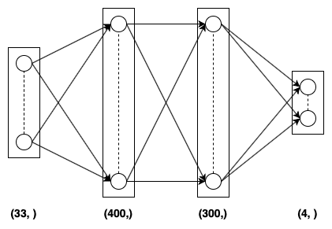
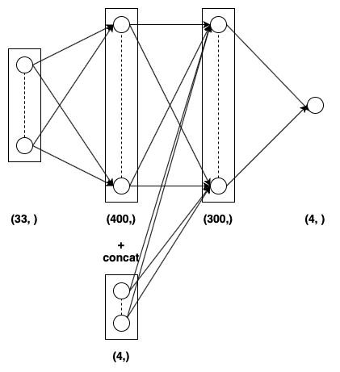

# Report of training the agent

The model was trained for a maximum of 2,000 episodes but the agent was able to solve the environment (i.e. get atleast +30 average score over 100 adjacent episodes).

## Model

The Actor Network has three dense (or fully connected layers). The first two layers have <b>400 and 300</b> nodes respectively activated with <b>ReLU</b> activation function. The final (output layer) has <b>4</b> nodes and is activated with tanh activation. This network takes in as input the <b>33</b> dimensional current state and gives as output <b>4</b> to provide the action at current state that the agent is supposed to take.

The Critic Network has three dense (or fully connected layers). The first two layers have <b>404 and 300</b> nodes respectively activated with <b>ReLU</b> activation function. The final (output layer) has <b>4</b> nodes and is activated with linear activation (no activation at all). This network takes in as input the <b>33</b> dimensional current state and <b>4</b> dimensional action and gives as output a single real number to provide the Q-value at current state and action taken in that state.

Both the neural networks used Adam optimizer and Mean Squared Error (MSE) as the loss function.

The following image provides a pictorial representation of the Actor Network model:

  

The following image provides a pictorial representation of the Critic Network model:

  

The following image provides the plot for score v/s episode number:

  

## Algorithm

The algorithm used to train both of these agents is Deep Deterministic Policy Gradients (DDPG) which is an Actor-Critic model. Each agent has two neural networks - Actor and Critic.

The Actor neural network takes in as input the current state that the agent experiences and gives as output the probability of each action, with the highest probability to the action to be selected at the current state. In a way the Actor model outputs the policy of an agent.

The Critic neural network takes in as input the current state and the action that is taken at that state (which is generated by the Actor model) and computes the Q-value for the particular (state, action) pair.

Thus the Actor and Critic model work in tandem until a near optimal policy is generated by the Actor neural network.

For more information on the DDPG model follow the link containing tutorial by <b>OpenAI</b> :- <a href='https://spinningup.openai.com/en/latest/algorithms/ddpg.html'>DDPG OpenAI</a>

## Performance

The model was trained on MacBook Air 2017 with 8GB RAM and Intel Core i5 Processor.

<ul>
  <li><b>Number of episodes required to solve the environment</b>: -37 episodes</li>
  <li><b>Final score of the agent</b>: 30.57</li>
</ul>

## Hyperparameters used

| Hyperparameter           | Value  | Description                                               |
|--------------------------|--------|-----------------------------------------------------------|
| Buffer size              | 100000 | Maximum size of the replay buffer                         |
| Batch size               | 128    | Batch size for sampling from replay buffer                |
| Gamma (<b>γ</b>)         | 0.99   | Discount factor for calculating return                    |
| Tau (<b>τ</b>)           | 0.001  | Hyperparameter for soft update of target parameters       |
| Learning Rate Actor      | 0.0003 | Learning rate for the actor neural network                |
| Learning Rate Critic     | 0.001  | Learning rate for the critic neural network               |

## Future work

The following algorithms can be considered for further development of this agent:

<ul>
  <li>Proximal Policy Optimization (PPO)</li>
  <li>Generalized Advantage Estimation (GAE)</li>
  <li>Advantage Actor-Critic (A2C)</li>
  <li>Asynchronous Advantage Actor-Critic (A3C)</li>
</ul>
